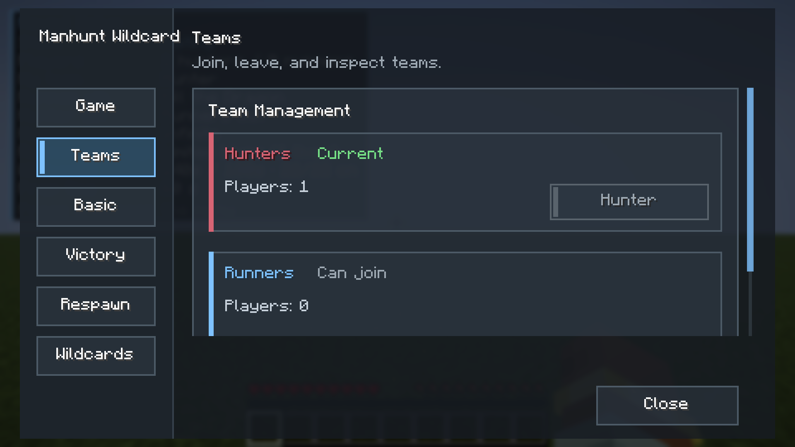
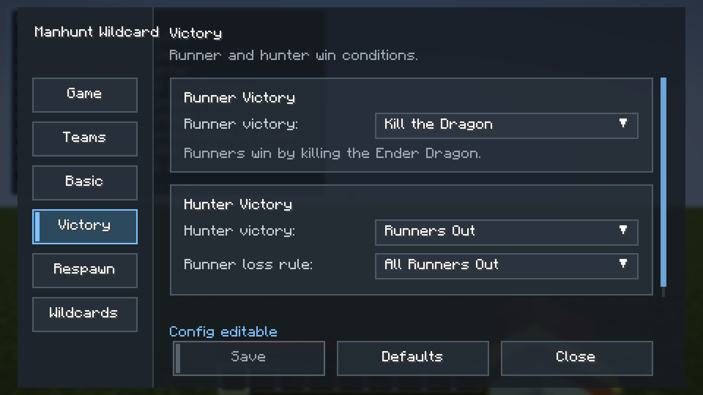
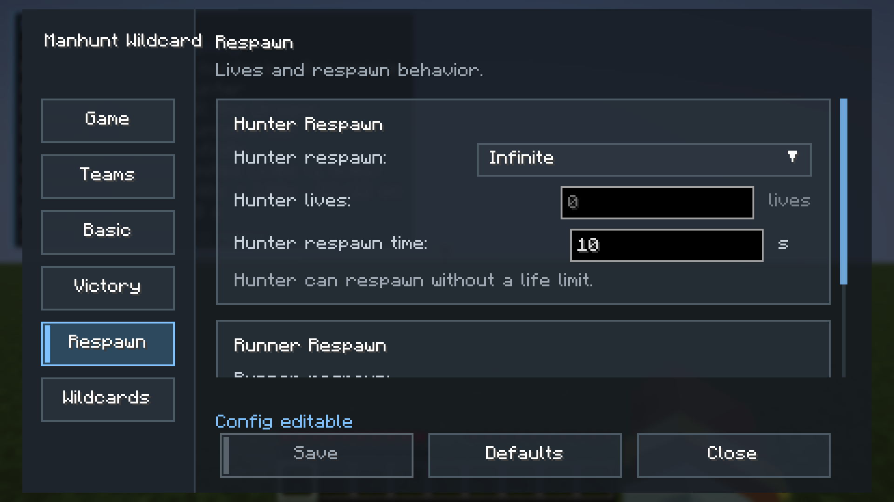

# Manhunt Wildcard

English | [简体中文](README.md)

Manhunt Wildcard is a Fabric mod for Minecraft Manhunt. Players split into hunters and runners, and random wildcard events fire periodically during the round to keep the chase unpredictable.


## Inspiration

Part of the idea comes from the recent APEX Legends wildcard seasons: temporary rule twists layered on top of the normal match so every round brings new risks, chances, and tactical calls. Manhunt Wildcard brings that "in-round rule variant" concept to Minecraft Manhunt so the chase no longer relies on fixed routes and pacing.

## Features

- Hunter vs runner team gameplay
- Operator-controlled game start, stop, and wildcard testing
- Preparation phase to prevent messy starts
- Tracking compass for hunters, refreshed by server config
- Periodic random wildcards shown through HUD, BossBar, and chat messages
- Multiple runner and hunter win conditions
- Configurable respawn modes, lives, death drops, and preparation boundary
- Configurable hunter-to-runner damage multiplier and hunter / runner speed multipliers
- Configurable piglin bartering ender pearl chance (40% by default)
- "Round Setup" HUD shown automatically in the lobby; non-operators press `M` during the round for a status panel
- English and Simplified Chinese language files using Minecraft's native lang system

## How a Round Plays

### 1. Preparation

Starting a game begins a countdown. Hunters are held inside a boundary around spawn while runners get a head start. The BossBar at the top shows the remaining preparation time.


### 2. The Chase

Once preparation ends, hunters receive a tracking compass. The objective panel on the left shows the runners' current win goal (survive time, collect items, and so on) and the action bar shows your role.


### 3. Wildcards

Every so often a wildcard is drawn. A short reveal animation plays, the rule description appears at the top left, and the BossBar counts down its duration. Below: "Featherweight" in effect.


### 4. Kill and Respawn Feedback

A hunter kill pops a feedback card at the top right; in kill-count mode it also shows how many kills remain. Runner respawns get a matching notice.


### 5. Round End

When either side meets its win condition the round ends: the result shows at the top right, a full summary is printed to chat, and the winners get fireworks.


### 6. Status HUDs

While a round is being set up, a "Round Setup" panel appears at the top left for everyone, listing win conditions, respawn rules and wildcard settings. It disappears automatically once the round starts.


During the round, non-operators press `M` to toggle a "Round Status" panel with the phase countdown, current wildcard and time left.


## New Wildcards

| Key Scramble | Tiny Players |
| --- | --- |
|  |  |

| Fragile | Who Are You? |
| --- | --- |
|  |  |

| Stay Away! | Backrooms! |
| --- | --- |
|  |  |

When the Backrooms end you drop back over your entry point with no fall damage:


## Wildcards

| Wildcard | Effect |
| --- | --- |
| Speed Rush | Everyone gets a speed boost |
| Featherweight | Jump boost + slow falling |
| Glowing | All players glow |
| Night Hunt | Forced night + hunter night vision |
| Explosive Death | Deaths or kills trigger explosions |
| Supply Drop | Random supply chests spawn |
| Hunter Radar | Hunters get distance hints to the nearest runner |
| Compass Chaos | Tracking direction is offset |
| Hunger Chase | Faster hunger, food gives speed changes |
| Weapon Overheat | Rapid attacks trigger overheat penalties |
| Light Load | Light armor speeds up, heavy armor slows down |
| Block Decay | Newly placed blocks vanish after a delay |
| Pearl Frenzy | Periodic ender pearls with possible side effects |
| Wind Charge Brawl | Periodic wind charges |
| Blood Rage | Low health grants buffs |
| Key Scramble | Every hit shuffles movement keys; a top-right HUD shows the current layout |
| Tiny Players | Everyone shrinks to about one block tall |
| Fragile | Everyone's max health drops to three hearts |
| Who Are You? | Everyone becomes Steve, name tags hide, tab list and chat show "Player" |
| Stay Away! | Runners get an unbreakable Sharpness 255 golden sword that cannot be dropped or picked up by hunters |
| Backrooms! | Everyone drops into a yellow maze dimension; hunters glow red for a second every 20 s; fall through a false floor to get home; once a whole side is out everyone returns |
| Disabled | No extra effect this round; used as a pacing placeholder |

## Config Screen

Press `M` by default to open the config screen (rebindable in Controls). Operators can edit rules while the game is waiting. Regular players use it to join a team in the lobby; once the round has started, `M` toggles a compact round status panel instead.

### Game page

Current state, your team, wildcard status, and the start button for operators.


### Teams page

Join hunters or runners and see both counts.



### Basic page

Preparation and ending time, refresh intervals, preparation boundary, death drops, role balance (hunter-to-runner damage and both speed multipliers), piglin bartering pearl chance.


### Victory page

Pick one runner win condition (kill the dragon, survive time, reach location, collect item) and one hunter win condition (all runners out, kill count).



### Respawn page

Hunter / runner respawn mode, lives, and respawn time.



### Wildcards page

Set wildcard interval and duration, toggle each wildcard, and tune the ones with extra parameters.


The **Debug page** requires `/hw debug true` and offers start / stop, roll a wildcard now, and testing any single wildcard.

## Requirements

- Minecraft `1.21.11`
- Fabric Loader `0.16.0+`
- Fabric API
- Java `21`

Install on both client and server. The server runs the game logic; the client provides the config screen, HUDs, skin swap, and localized text.

## Installation

1. Install Fabric Loader.
2. Install Fabric API.
3. Download `MC-Manhunt-Wildcard-<version>.jar`.
4. Put the jar into the `mods/` folder on both client and server.
5. Launch the game or server.

The config file is created on first launch:

```text
config/hunterwildcard.json
```

The internal config name and mod ID stay `hunterwildcard` for compatibility with existing configs, language keys, and the network protocol.

## Player Commands

| Command | Description |
| --- | --- |
| `/hw join hunter` | Join hunters |
| `/hw join runner` | Join runners |
| `/hw leave` | Leave your team |
| `/hw status` | Show the current game status |
| `/hw wildcard list` | List wildcard enable states |

## Operator Commands

These commands require OP:

| Command | Description |
| --- | --- |
| `/hw start` | Start the game |
| `/hw stop` | Stop the game |
| `/hw wildcard roll` | Roll a wildcard now |
| `/hw wildcard stop` | Stop the current wildcard |
| `/hw wildcard test <id>` | Test a specific wildcard |
| `/hw config reload` | Reload config |
| `/hw config save` | Save config |
| `/hw debug true` | Enable the debug page |
| `/hw debug false` | Disable the debug page |

## Design Goals

Manhunt Wildcard aims to make Manhunt rounds more varied:

- Break the fixed rhythm of the chase
- Add randomness, on-the-spot judgment, and counterplay
- Keep the core objective feel of Minecraft Manhunt
- Give server owners a configurable, testable, localizable gameplay extension

## License

This project is licensed under the MIT License. See [LICENSE](LICENSE).
