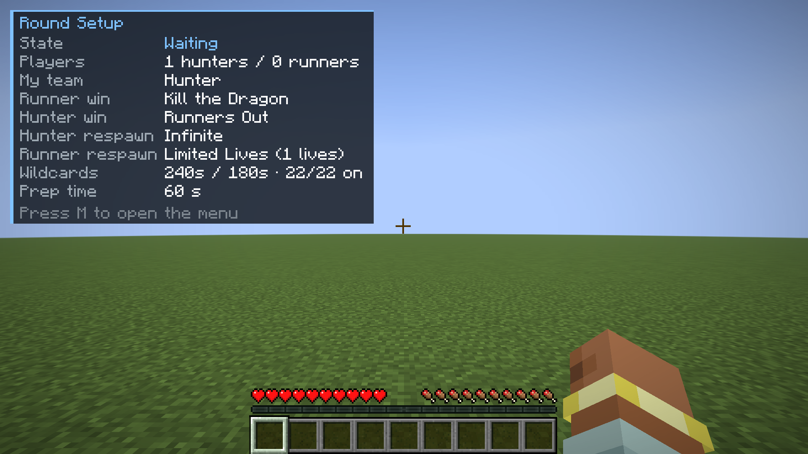
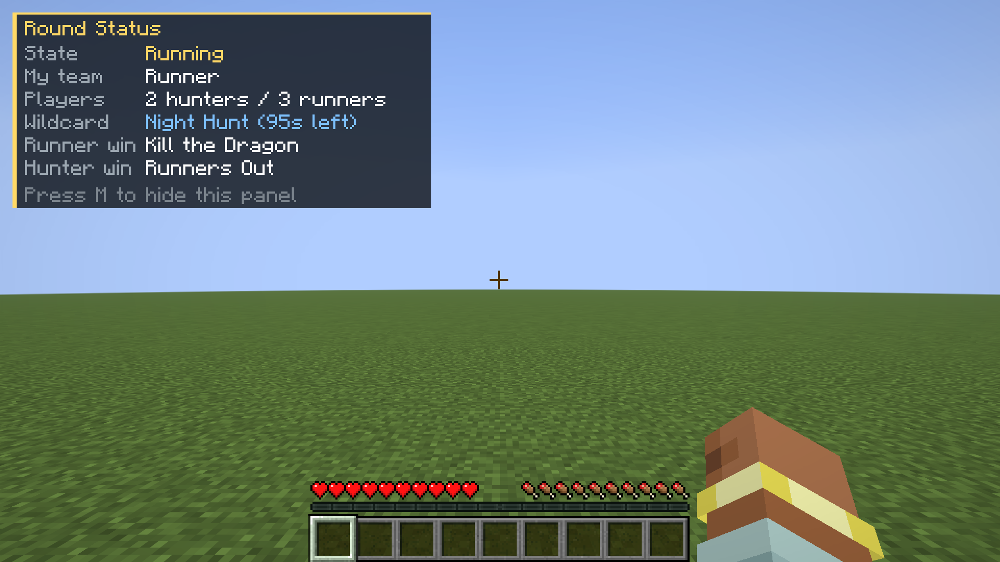
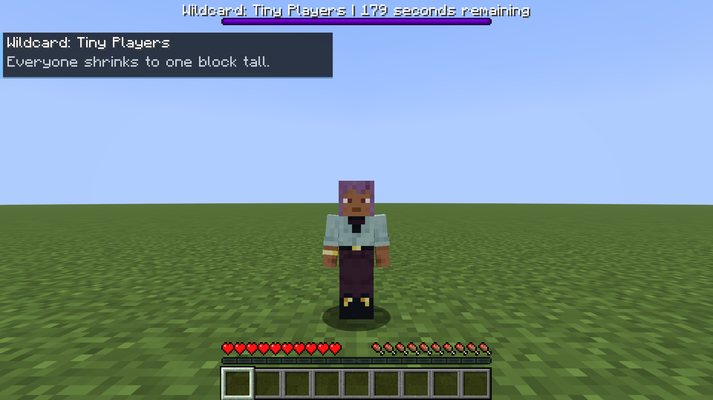
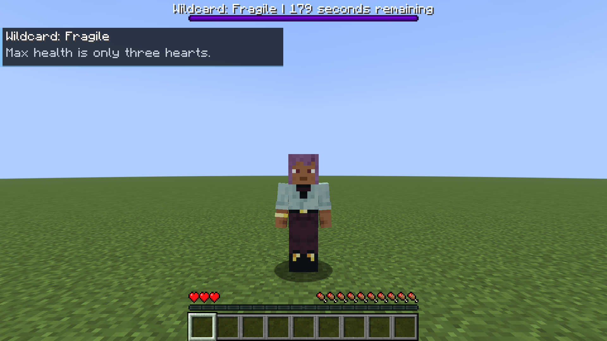
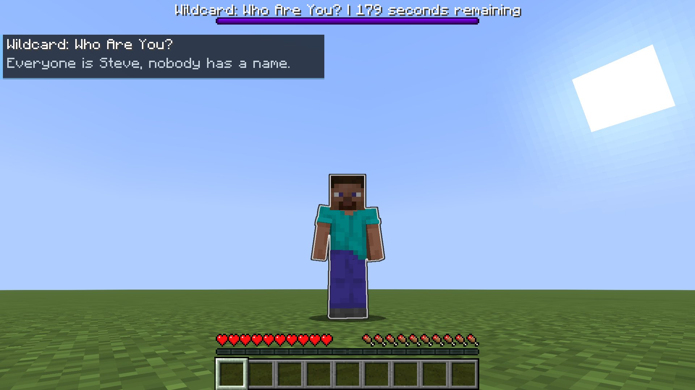
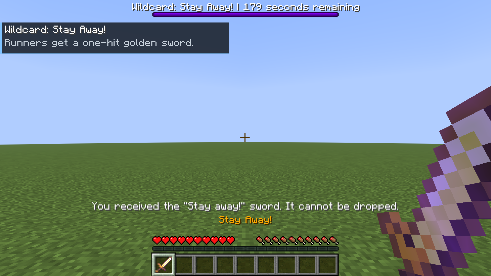
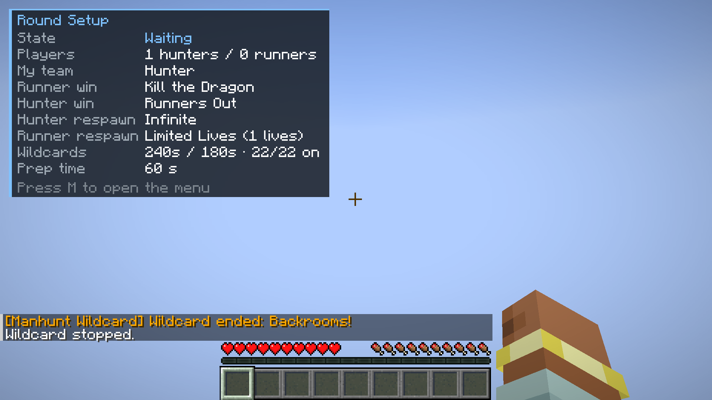
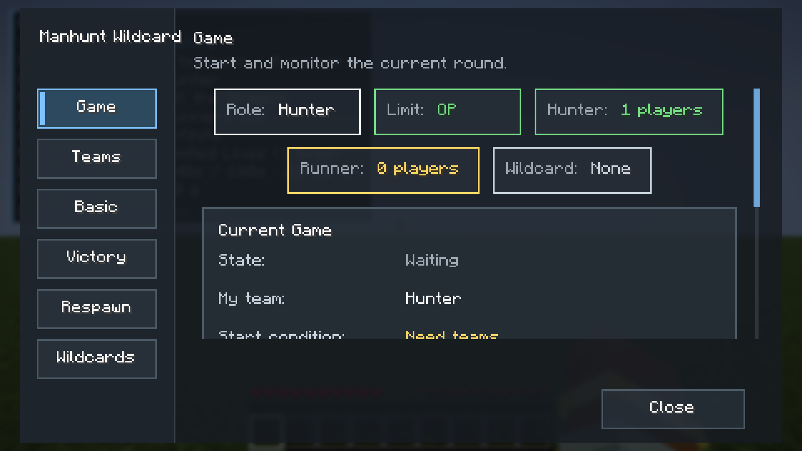
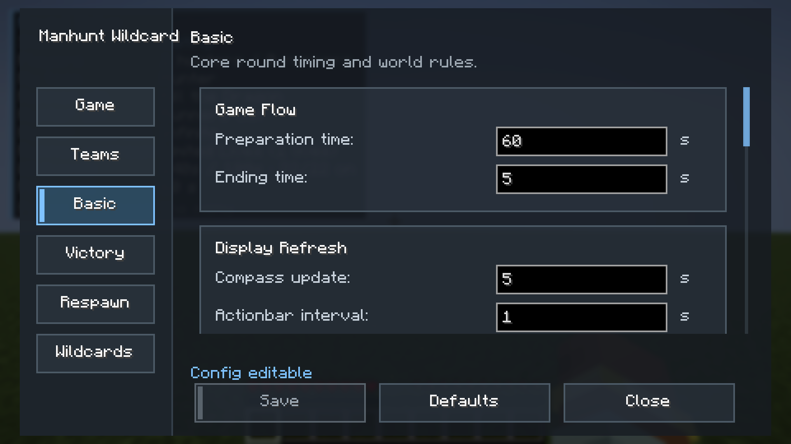
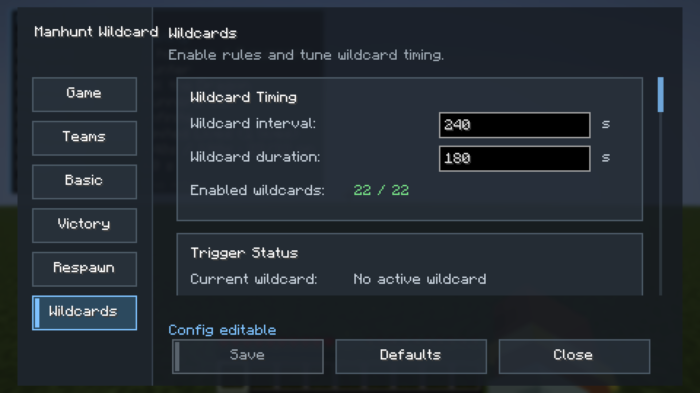

# Manhunt Wildcard

[English](README.en.md) | 简体中文

Manhunt Wildcard 是一个用于 Minecraft Manhunt / 猎人追逃玩法的 Fabric 模组。玩家分为猎人和逃亡者，在对局中周期性触发随机外卡事件，让追逃节奏持续变化。


## 灵感来源

本 MOD 的玩法灵感部分来自近期赛季 APEX Legends 的外卡活动：在常规对抗规则之外加入临时规则变化，让每一局都出现新的风险、机会和战术选择。Manhunt Wildcard 将这种"局内变体规则"的思路放进 Minecraft Manhunt，让追逃过程不再只依赖固定路线和固定节奏。

## 核心功能

- 猎人 vs 逃亡者阵营玩法
- 管理员控制对局开始、停止和外卡测试
- 准备阶段，避免开局混战
- 猎人追踪指南针，按配置周期刷新目标
- 指南针可选目标：潜行 + 右键循环「最近 → 各逃亡者」，右键打开选择菜单，物品名显示目标和距离
- 猎人名字红色、逃亡者蓝色，原版追踪条只显示本阵营
- 击杀判定：被猎人打过后 15 秒内的死亡计为该猎人击杀，纯环境死亡按次数折算
- 死亡等待全屏黑屏，复活点为远离死亡点（逃亡者还远离猎人）的随机地表位置
- 存活模式自动加方形世界边界（半径可配），逃亡者不能靠无限拉扯稳赢
- 未加入阵营的玩家自动旁观；部分规则可在对局中热更新
- 周期性随机外卡，通过 HUD、BossBar、聊天提示展示
- 多种逃亡者与猎人胜利条件
- 可配置复活模式、生命数、死亡掉落和准备边界
- 可配置猎人对逃亡者伤害倍率、猎人 / 逃亡者移速倍率
- 可配置猪灵交易末影珍珠概率（默认 40%）
- 等待阶段自动显示"本局设置"HUD，对局中普通玩家按 `M` 查看对局状态
- 中英文语言文件，支持 Minecraft 原生语言切换

## 一局是怎么进行的

### 1. 准备阶段

开始对局后进入准备倒计时。猎人被限制在出生点附近的边界内，逃亡者趁这段时间拉开距离。顶部 BossBar 显示剩余准备时间。


### 2. 对局进行中

准备结束后猎人拿到追踪指南针开始追击。左侧目标面板显示逃亡者当前的胜利目标（例如存活时间、收集物品），底部 ActionBar 提示自己的身份。


### 3. 外卡触发

每隔一段时间随机抽取一张外卡，先播放抽卡动画，然后在左上角显示规则说明，BossBar 显示剩余时间。下图为"轻盈之身"生效时的画面。


### 4. 击杀与复活反馈

猎人击杀逃亡者时右上角弹出击杀反馈；在击杀计数模式下还会显示距离目标还差几次。逃亡者复活时也有对应提示。


### 5. 对局结算

任一方达成胜利条件后进入结算：右上角显示胜负，聊天栏输出完整结算信息，胜方头顶放烟花。


### 6. 状态 HUD

等待阶段只要有人加入队伍，左上角自动显示"本局设置"，所有玩家都能看到这局的胜利条件、复活规则和外卡设置；对局开始后它会自动消失。



对局中，非 OP 玩家按 `M` 可以随时切换"对局状态"面板，查看阶段倒计时、当前外卡和剩余时间。



## 新外卡一览

| 受伤乱键 | 全体变小 |
| --- | --- |
|  |  |

| 小心翼翼 | 你是谁？ |
| --- | --- |
|  |  |

| 别过来！ | 后室！ |
| --- | --- |
|  |  |

后室结束后从主世界进入点上空无伤落回：



## 外卡列表

| 分类 | 外卡 | 效果 |
| --- | --- | --- |
| 战斗 | 回头杀 | 玩家之间只有背后攻击有效且双倍，正面攻击无伤害无击退 |
| 战斗 | 吸血鬼 | 攻击任意生物按伤害回血 |
| 战斗 | 血怒时刻 | 血量不到 3 颗心时每次攻击一击必杀 |
| 战斗 | 武器过热 | 连续攻击积累热量，准星下方 HUD 热量条 |
| 战斗 | 别过来！ | 逃亡者获得锋利 255 的无限耐久金剑，无法丢弃，猎人无法拾取 |
| 战斗 | 小心翼翼 | 所有玩家生命上限变为 3 颗心 |
| 战斗 | 死亡爆炸 | 死亡或击杀触发爆炸 |
| 战斗 | 受伤乱键 | 受伤即随机打乱移动键位，右上角 HUD 显示当前键位 |
| 机动 | 闪电侠 | 全员速度 X |
| 机动 | 移形换影 | 打中另一名玩家时，对方瞬移到 1～4 格外 |
| 机动 | 受伤瞬移 | 受伤就被随机传送到 1～15 格外，落点可能是岩浆 |
| 机动 | 空间波动 | 每 60 秒（可配）同维度所有玩家随机重新分配位置（可能抽到原地），全程倒计时 |
| 机动 | 传送门 | 随机两两一组，各自附近生成一次性传送门（折跃门方块），进入就传到同组另一人门口；落单者并入随机一组 |
| 机动 | 珍珠狂潮 | 定期补给末影珍珠，但使用可能有副作用 |
| 机动 | 风弹乱斗 | 定期补给风弹 |
| 机动 | 轻装上阵 | 轻甲加速，重甲减速 |
| 机动 | 饥饿追逐 | 吃任何食物获得 10 秒速度 VI |
| 视野 | 静止发光 | 原地不动超过 1 秒就发光（猎人红、逃亡者蓝），一动就消失 |
| 视野 | 潜行冻结 | 潜行时隐身且无敌，但不能移动、跳跃和攻击 |
| 视野 | 猎人雷达 | 逃亡者全程发光，猎人进入警告距离（可配）内时逃亡者收到提示 |
| 视野 | 你是谁？ | 全员史蒂夫皮肤，隐藏名牌，TAB 和聊天中名字都显示为"玩家" |
| 视野 | 全体变小 | 所有玩家缩小到约一格高 |
| 视野 | 地动山摇 | 触发 30 秒后重力转向随机水平方向（全程倒计时），视角、移动、跳跃都在新重力下工作，可以站在树干和墙面上，外卡结束才恢复 |
| 环境与道具 | 补给空投 | 每隔一段时间在猎人与逃亡者中点投下补给箱（每名逃亡者一只），宣布时竖起信标柱，20 秒后落地 |
| 环境与道具 | 掉落物炸弹 | 扔出的任何物品 2 秒后爆炸，不破坏方块也不炸掉落物 |
| 环境与道具 | 连锁挖矿 | 挖方块时朝向前方的 3×3×3 一并破坏并掉落，只算当前工具能采集的方块 |
| 环境与道具 | 方块腐化 | 新放置方块延迟消失 |
| 环境与道具 | 后室！ | 全员掉入黄色迷宫维度，每 20 秒双方同时发光 5 秒（猎人红、逃亡者蓝），踩到假地板掉出去回主世界，任一方全员离开则全体返回 |

## 配置界面

默认按 `M` 打开菜单（可在按键设置中修改），任何阶段都能打开。界面只有三页，OP 还能看到调试页。

### 对局页

查看对局状态、加入猎人或逃亡者、由 OP 开始对局；对局开始后这里有一个按钮切换左上角的「对局状态」面板。



### 规则页

一个总览页，五个子页，点「编辑」进入，左上角面包屑返回：

| 子页 | 内容 |
| --- | --- |
| 时间与边界 | 准备时间、猎人准备边界 |
| 胜利条件 | 逃亡者胜利方式四选一（击败末影龙、存活指定时间、到达指定位置、收集指定物品）及其参数；存活模式的世界边界开关与半径；猎人胜利方式二选一（逃亡者全部出局、击杀计数） |
| 复活与死亡 | 猎人 / 逃亡者复活模式、生命数、复活时间；随机复活点开关与距离；死亡掉落 |
| 击杀判定 | 猎人击中后的击杀归属窗口（秒）；纯环境死亡几次算一次猎人击杀 |
| 阵营平衡 | 猎人对逃亡者伤害倍率、双方移速倍率、猪灵交易珍珠概率、追踪条只显示本阵营 |

对局进行中 OP 仍可修改移速、伤害倍率、胜利目标数值、外卡开关与参数、复活时间与复活点、击杀判定、掉落等「热更新」项，保存后全服提示「规则已更新」；准备时间、胜利方式、复活模式等则锁定。



### 外卡页

设置外卡间隔与持续时间，逐张开关外卡，部分外卡有单独参数（子页）。



**调试页**需要先执行 `/hw debug true`，提供开始 / 停止对局、立即抽卡和单独测试任意外卡。

## 环境要求

- Minecraft `1.21.11`
- Fabric Loader `0.16.0+`
- Fabric API
- Java `21`

建议客户端与服务端同时安装。服务端负责对局逻辑，客户端用于配置界面、HUD、皮肤替换和本地语言显示。

## 安装方式

1. 安装 Fabric Loader。
2. 安装 Fabric API。
3. 下载 `MC-Manhunt-Wildcard-<version>.jar`。
4. 将 jar 放入客户端和服务端的 `mods/` 文件夹。
5. 启动游戏或服务端。

首次启动会生成配置文件：

```text
config/hunterwildcard.json
```

内部配置文件名和 MOD ID 仍保留 `hunterwildcard`，用于兼容已有配置、语言 key 和网络协议。

## 玩家命令

| 命令 | 说明 |
| --- | --- |
| `/hw join hunter` | 加入猎人 |
| `/hw join runner` | 加入逃亡者 |
| `/hw leave` | 离开队伍 |
| `/hw status` | 查看当前对局状态 |
| `/hw wildcard list` | 查看外卡启用状态 |

## 管理员命令

以下命令需要 OP 权限：

| 命令 | 说明 |
| --- | --- |
| `/hw start` | 开始对局 |
| `/hw stop` | 停止对局 |
| `/hw wildcard roll` | 立即抽取外卡 |
| `/hw wildcard stop` | 停止当前外卡 |
| `/hw wildcard test <id>` | 测试指定外卡 |
| `/hw config reload` | 重新加载配置 |
| `/hw config save` | 保存配置 |
| `/hw debug true` | 开启调试界面 |
| `/hw debug false` | 关闭调试界面 |

## 设计目标

Manhunt Wildcard 的目标是让 Manhunt 对局更具变化：

- 让追逃节奏不再完全固定
- 增加随机性、临场判断和反制空间
- 保留 Minecraft Manhunt 的核心目标感
- 给服主提供可配置、可测试、可本地化的玩法扩展

## License

本项目使用 MIT License，详见 [LICENSE](LICENSE)。
