# Manhunt Wildcard

[English](README.en.md) · 简体中文 · [Modrinth](https://modrinth.com/mod/manhunt-wildcard) · [更新日志](CHANGELOG.md)

**追击、逃亡，以及随时改变战局的随机外卡。**

Minecraft `1.21.11–26.2` · Fabric · 28 张外卡 · 中英双语

[安装与开局](#安装与开局) · [界面指南](#界面指南) · [玩法预设](#玩法预设) · [外卡](#外卡) · [命令与配置](#命令与配置)

## 安装与开局

客户端与服务端安装对应游戏版本的同一份模组，以及对应版本的 Fabric API。建议使用 Fabric Loader `0.19.3` 或更新版本。

| Minecraft | Java | 发布文件 |
| --- | --- | --- |
| 1.21.11 | 21+ | `MC-Manhunt-Wildcard-1.4.5-mc1.21.11.jar` |
| 26.1 | 25+ | `MC-Manhunt-Wildcard-1.4.5-mc26.1.jar` |
| 26.1.1 | 25+ | `MC-Manhunt-Wildcard-1.4.5-mc26.1.1.jar` |
| 26.1.2 | 25+ | `MC-Manhunt-Wildcard-1.4.5-mc26.1.2.jar` |
| 26.2 | 25+ | `MC-Manhunt-Wildcard-1.4.5-mc26.2.jar` |

每个文件仅对应表中列出的正式版本。从 [Modrinth](https://modrinth.com/mod/manhunt-wildcard/versions) 或 [GitHub Releases](https://github.com/xiaoming6680/MC-Manhunt-Wildcard/releases) 下载。源码构建见[构建文档](docs/BUILDING.md)。

当前模组版本为 `1.4.5`。两端都要替换为本次同一份 JAR，并移除旧包；本次新增配置采用 v3 协议，不能与旧协议构建混用。协议不兼容时会明确提示更新。

1. 将 对应的 `MC-Manhunt-Wildcard-1.4.5-mc<游戏版本>.jar` 放入对应实例的 `mods/`。
2. 进入世界按 **M**，加入红色猎人或蓝色逃亡者阵营。
3. 管理员选择预设或调整规则，点击 **应用**，双方有人后开始游戏。

猎人用指南针追踪逃亡者；逃亡者完成胜利目标。指南针右键选择目标，潜行右键循环目标。未加入阵营的玩家旁观。

等待复活时自动观察存活队友，按 **Z / X** 切换上一位 / 下一位队友（可在控制设置中改键）；没有存活队友时可自由飞行观察。已出局玩家默认自由观察，**Z / X** 可前往全场其他在线玩家的位置，包括对方阵营，跳转后仍可自由飞行。复活倒计时、剩余生命与复活位置仍按原规则处理。

地狱或末地死亡后回主世界复活：沿用可用的主世界出生点，否则回世界出生点；开启随机复活时在该主世界位置周围寻找落点。观察队友不会改变复活目的地。

每次成功开局进入准备阶段，重置所有在线玩家的成就进度（含旁观者及部分完成的条件）。死亡掉落规则在准备阶段也生效。

## 界面指南

### 对局

阵营卡片展示成员与状态，下方分阵营显示本局目标。加入按钮使用阵营颜色，离队操作标红。

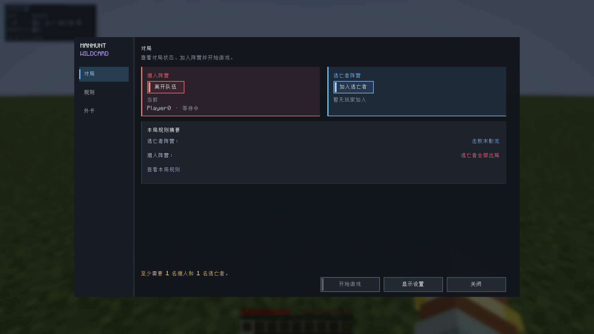

### 规则

主页按分类展示本局规则。左侧子导航或分类旁的 **调整** 进入编辑；无效参数与重复说明收起。输入时间支持 `分:秒` 或秒数。

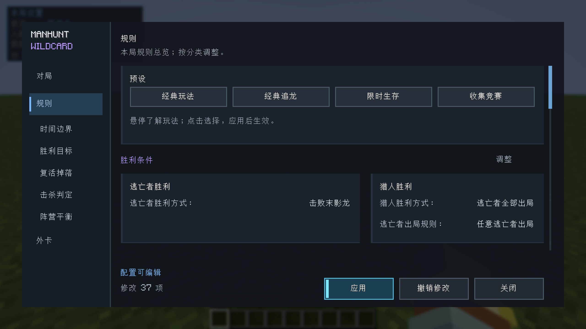

修改保留为草稿，点击 **应用** 后生效；**撤销修改** 放弃草稿。普通玩家可查看规则，管理员可编辑。对局中只开放可热更新的项目，冲突或保存失败会保留草稿并提示。

### 外卡

保留四类矩阵。按名称、效果或 ID 搜索；小 **i** 悬停查看说明，**设置** 仅调整专属参数。外卡开关统一在矩阵操作，设置页的 **本页默认** 只重置参数。时间在顶部编辑。

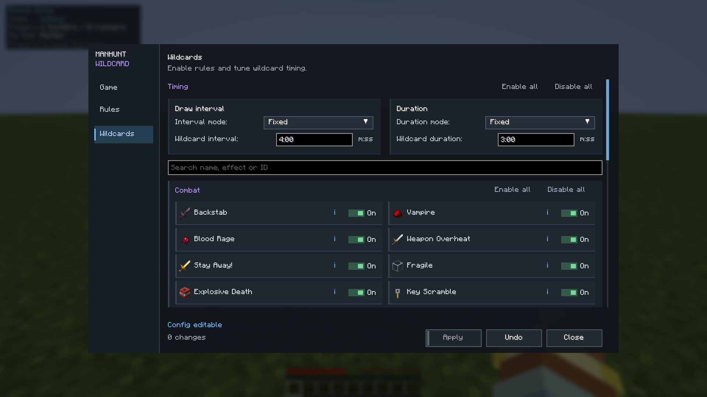

顶部 **全部开启 / 全部关闭** 操作全部外卡，分类旁入口只操作该分类；搜索不会改变批量操作范围。

物品选择、悬停说明与本地显示设置

收集目标支持物品名称搜索，也可输入物品 ID。

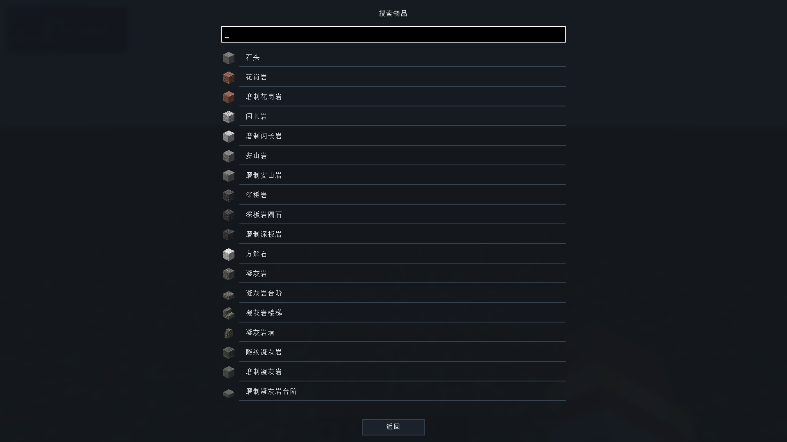

悬停只显示效果说明，长文案自动换行。

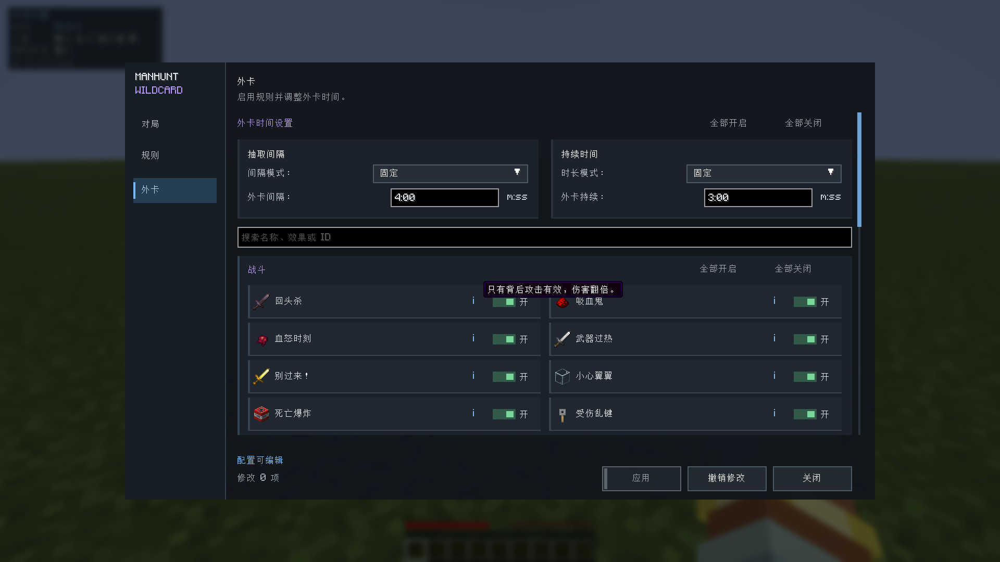

本地设置可调整 HUD 缩放、透明度、边距、动画、闪光与击杀反馈停留时间。**H** 切换状态 HUD。

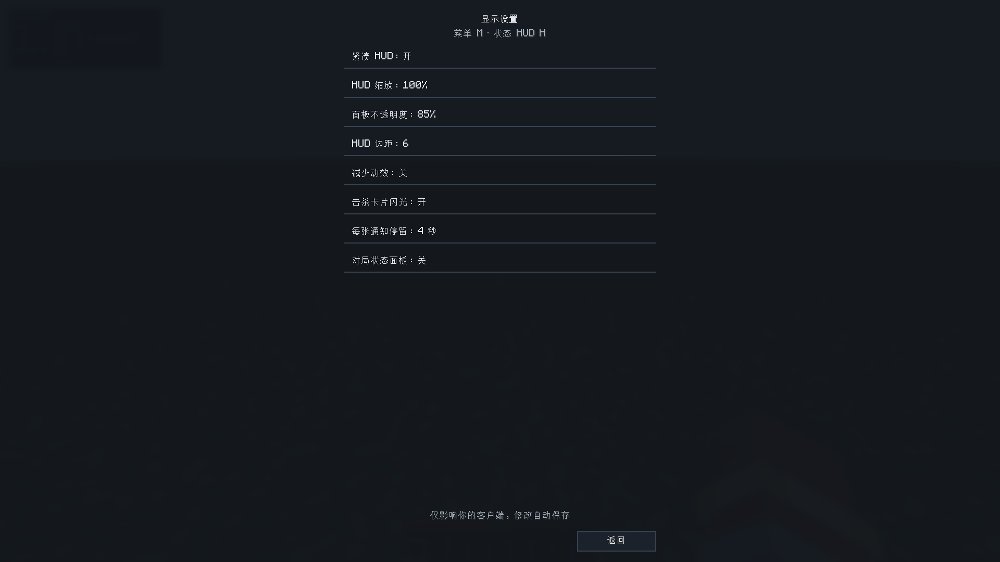

## 玩法预设

悬停查看介绍，点击生成可继续调整的草稿，应用后生效。

| 预设 | 逃亡者目标 | 复活与外卡 |
| --- | --- | --- |
| 经典玩法 | 击败末影龙 | 逃亡者一命，猎人无限复活；关闭全部外卡 |
| 经典追龙 | 击败末影龙 | 逃亡者 3 命；保留当前外卡开关 |
| 限时生存 | 存活 15 分钟 | 逃亡者 3 命；保留当前外卡开关 |
| 收集竞赛 | 收集 16 颗钻石 | 逃亡者 3 命；保留当前外卡开关 |

经典玩法参考 [Dream 的 Manhunt](https://www.youtube.com/watch?v=qqOxkuO3ip0)：使用原版掉落和复活位置，伤害与移速 1×，关闭额外交易加成。本模组保留 1 秒开局与猎人复活过渡；多逃亡者时，任意一人出局即判阵营失败，可在规则中调整。

## 外卡

外卡按配置间隔随机触发。左上角持续显示当前外卡介绍，直到外卡结束；M 菜单的小 i 也可查看效果。右上角显示击杀与对局反馈。

| 受伤乱键 | 后室 |
| --- | --- |
| 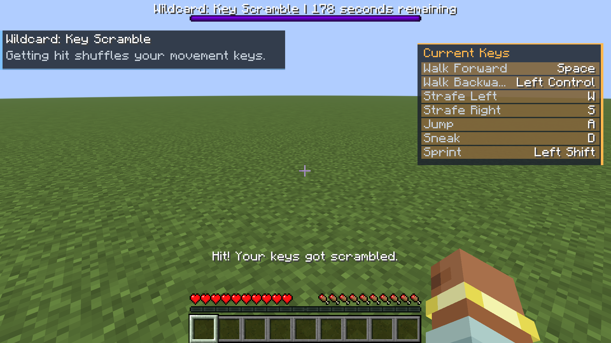 | 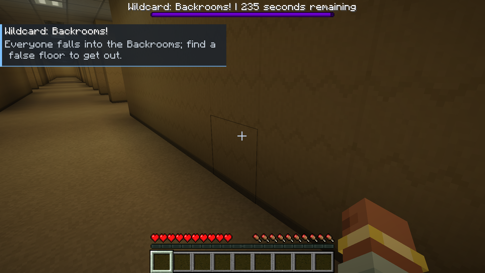 |

查看全部 28 张外卡及效果

| 分类 | 外卡 | 效果 |
| --- | --- | --- |
| 战斗 | 回头杀 | 玩家之间只有背后攻击有效且双倍，正面攻击无伤害无击退 |
| 战斗 | 吸血鬼 | 攻击任意生物按伤害回血 |
| 战斗 | 背水一战 | 血量不到 3 颗心时每次攻击一击必杀 |
| 战斗 | 武器过热 | 连续攻击积累热量，准星下方 HUD 热量条 |
| 战斗 | 别过来！ | 逃亡者获得锋利 255 的无限耐久金剑，无法丢弃，猎人无法拾取 |
| 战斗 | 小心翼翼 | 所有玩家生命上限变为 3 颗心 |
| 战斗 | 死亡爆炸 | 死亡或击杀触发爆炸 |
| 战斗 | 受伤乱键 | 受伤即随机打乱移动键位，右上角 HUD 显示当前键位 |
| 机动 | 闪电侠 | 全员速度 X |
| 机动 | 移形换影 | 打中另一名玩家时，对方瞬移到 1～4 格外 |
| 机动 | 受伤瞬移 | 受伤就被随机传送到 1～15 格外，落点可能是岩浆 |
| 机动 | 空间波动 | 每 60 秒（可配）同维度所有玩家随机重新分配位置（可能抽到原地），全程倒计时 |
| 机动 | 传送门 | 随机两两一组，各自附近生成一次性传送门（折跃门方块），进入就传到同组另一人门口；落单者并入随机一组 |
| 机动 | 珍珠狂潮 | 定期补给临时珍珠，使用可能有副作用；结束时回收剩余赠送珍珠，保留自有珍珠 |
| 机动 | 风弹乱斗 | 定期补给风弹 |
| 机动 | 轻装上阵 | 轻甲加速，重甲减速 |
| 机动 | 饥饿追逐 | 吃任何食物获得 10 秒速度 VI |
| 视野 | 静止发光 | 原地不动超过 1 秒就发光（猎人红、逃亡者蓝），一动就消失 |
| 视野 | 潜行冻结 | 潜行时隐身且无敌，但不能移动、跳跃和攻击 |
| 视野 | 猎人雷达 | 逃亡者全程发光，猎人进入警告距离（可配）内时逃亡者收到提示 |
| 视野 | 你是谁？ | 全员史蒂夫皮肤，隐藏名牌，TAB 和聊天中名字都显示为"玩家" |
| 视野 | 全体变小 | 所有玩家缩小到约一格高 |
| 视野 | 地动山摇 | 倒计时 30 秒后重力转向随机水平方向，视角、身体碰撞与操作同步翻转；可在墙面走跳，侧向跌落有伤害，结束后恢复 |
| 环境与道具 | 补给空投 | 每隔一段时间在猎人与逃亡者中点投下补给箱（每名逃亡者一只），宣布时竖起信标柱，20 秒后落地 |
| 环境与道具 | 掉落物炸弹 | 扔出的任何物品 2 秒后爆炸，不破坏方块也不炸掉落物 |
| 环境与道具 | 连锁挖矿 | 挖方块时朝向前方的 3×3×3 一并破坏并掉落，只算当前工具能采集的方块 |
| 环境与道具 | 方块腐化 | 新放置方块延迟消失 |
| 环境与道具 | 后室！ | 全员掉入黄色迷宫维度，每 20 秒双方同时发光 5 秒（猎人红、逃亡者蓝），踩到假地板掉出去回主世界，任一方全员离开则全体返回 |

对局 HUD、击杀反馈与结算示例（测试场景）

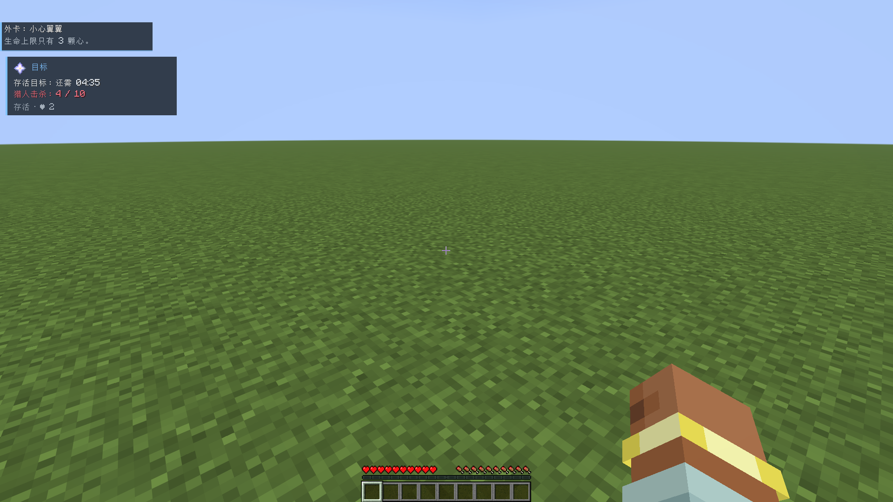

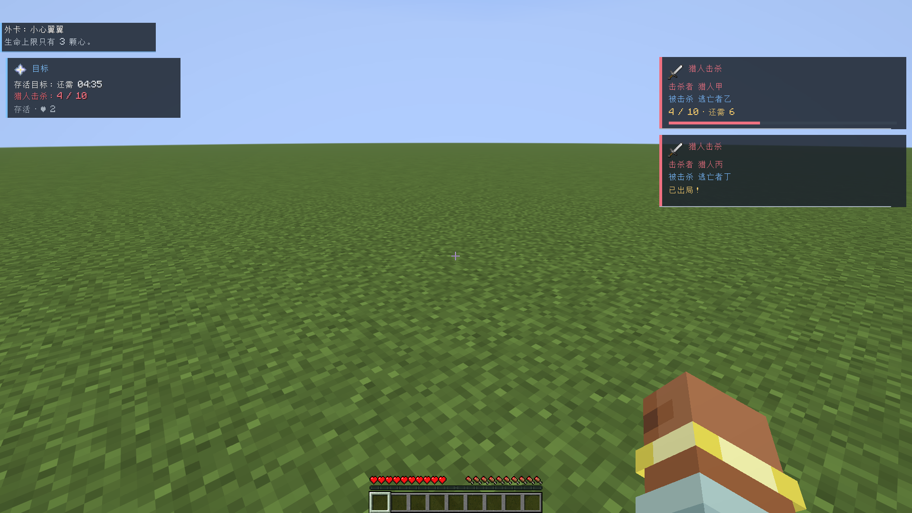

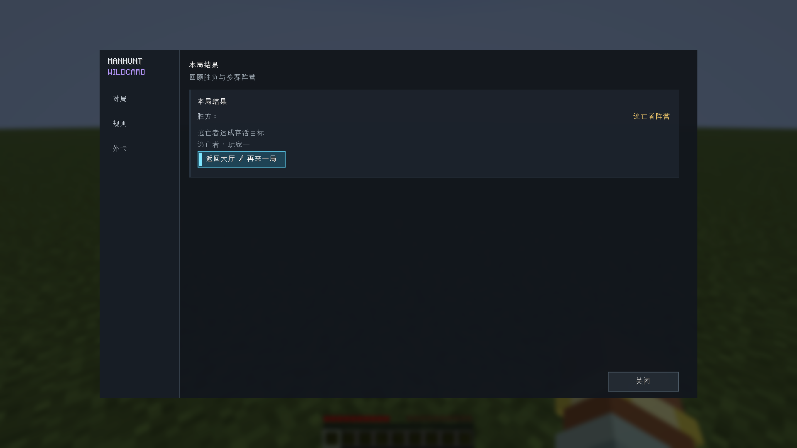

## 命令与配置

服务器规则：`config/hunterwildcard.json`。本地显示偏好：`config/hunterwildcard-ui.json`，不影响服务器规则。

首次运行默认采用外卡追龙：逃亡者共 3 条命，猎人无限复活，所有逃亡者出局才判负，28 张外卡全部开启。双方死亡正常掉落，伤害与移速为 1×。

| 默认项目 | 设置 |
| --- | --- |
| 开局准备 / 结算展示 | 60 秒 / 10 秒 |
| 指南针刷新 | 每 3 秒 |
| 普通外卡 | 固定间歇 180 秒、持续 120 秒；间歇从上一张结束后计算，抽卡另需 5 秒 |
| 切换随机时序后的初始范围 | 间歇 120～240 秒，持续 90～150 秒；默认仍为固定时序 |
| 后室时限 | 独立计时 180 秒，满足离开条件可提前结束 |
| 复活等待 | 双方基础 10 秒；猎人每次先前死亡额外增加 3 秒，上限额外 60 秒 |
| 随机复活 | 开启；逃亡者距死亡点 150～300 格，猎人 64～128 格；猎人尽量避开逃亡者 96 格 |
| 猪灵珍珠交易概率 | 加成开启，20% |
| 烈焰棒掉落概率 | 自定义默认关闭；在规则的平衡页启用后可设 0–100%，预设值 50% |
| 风弹爆炸倍率 | 150% |
| 切换限时生存后的初始目标 | 15 分钟，边界半径 500 格；默认胜利目标仍为末影龙 |

升级不会覆盖已有配置值；缺失项使用新默认值。菜单内的参数可在 M 菜单对应分类／外卡设置页点击 **本页默认**，检查草稿后点击 **应用**；只恢复当前页可编辑的项目。指南针刷新、结算时长等未在菜单展示的参数需修改 JSON，再执行 `/hw config reload`。“经典玩法”预设仍是一命、无外卡的原版追逃。

玩家与管理员命令

| 命令 | 说明 |
| --- | --- |
| `/hw join hunter` | 加入猎人 |
| `/hw join runner` | 加入逃亡者 |
| `/hw leave` | 离开队伍 |
| `/hw status` | 查看当前对局状态 |
| `/hw wildcard list` | 查看外卡启用状态 |

## 管理员命令

以下命令需要 OP 权限：

| 命令 | 说明 |
| --- | --- |
| `/hw start` | 开始对局 |
| `/hw stop` | 停止对局 |
| `/hw wildcard roll` | 立即抽取外卡 |
| `/hw wildcard stop` | 停止当前外卡 |
| `/hw wildcard test <id>` | 测试指定外卡 |
| `/hw config reload` | 重新加载配置 |
| `/hw config save` | 保存配置 |
| `/hw debug true` | 开启调试界面 |
| `/hw debug false` | 关闭调试界面 |

## 灵感与许可

玩法结合 Minecraft Manhunt 与 APEX Legends 外卡活动的临时规则变化。

[MIT License](LICENSE)
